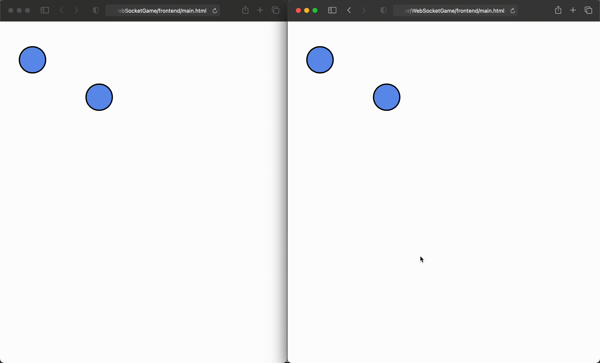

# WebSocketGame

## Technologies

### Basic
- Python
- FastAPI

### Code style
- black
- isort
- flake8
- pylint

## Instalation
- Clone the repository
```
git clone https://github.com/nikitunkun/WebSocketGame.git
or
git@github.com:nikitunkun/WebSocketGame.git
```
- Navigate to the project folder
```
cd WebSocketGame
```
- Run main.py
```
uvicorn --host 0.0.0.0 --port 8000 --reload backend.main:app
or
make run
```

## Preview


